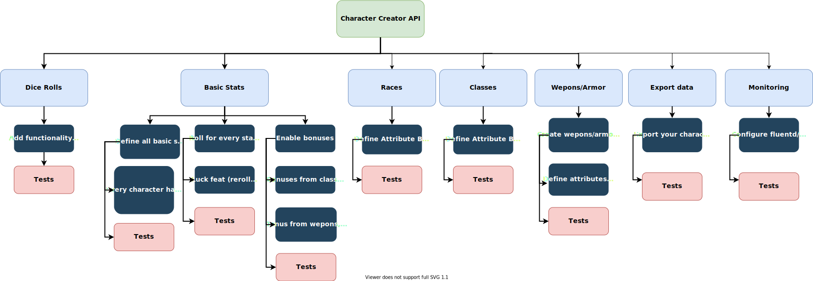

# Character Creator API

Character Creator API for tabletop RPGs.

## API Description

This API lets you create a character for tabletop RPGs, loosely based on D&D 5e
and Pillars of Eternity.

The following diagram describes the relationships designed for this application.



## Application requirements

* Maven 3.8
* Java 17
* Spring Boot 2.6
* Docker
* Docker Compose

## How to execute the application

Instantiate the database using the following command:

```
docker-compose up -d --build
```

You can use MongoDB Compass to manage and visualize your data during tests.

Run the application using IntelliJ. You can access the application
via `localhost:8080`, or via command line with `mvn spring-boot:run`

## Features

### Dice Rolls feature

- You can roll a D3, D4, D6, D10, D12, D20, and D100 dices.

### User feature

- Create new user, with username, email, and password.
- Retrieve user data.
- Allow users to change their username.
- Allow users to change their password.
- Allow users to delete their account.

### Player feature

- Allow a user to create a new player character.
- Allow a user to retrieve their player characters data.
- Allow a user to retrieve one of their player characters data.
- Allow a user to update their player character.
- Allow a user to delete their player character.

## Tests

Execute the tests running the following command (the command is slightly
different in Windows and macOS).

```
mvn clean install && google-chrome target/site/jacoco/index.html
```

## Author

Vitor Vidal - vitorvidal.dev@gmail.com

## License

This project uses the MIT License. You can read it [here].

[here]: https://github.com/vitorvidaldev/Character-Creator-API/blob/main/LICENSE